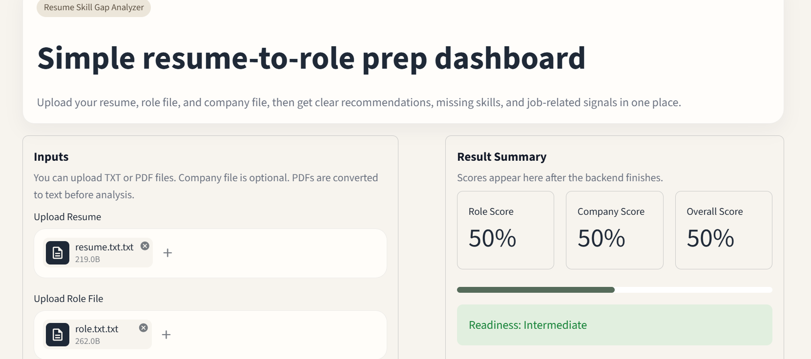
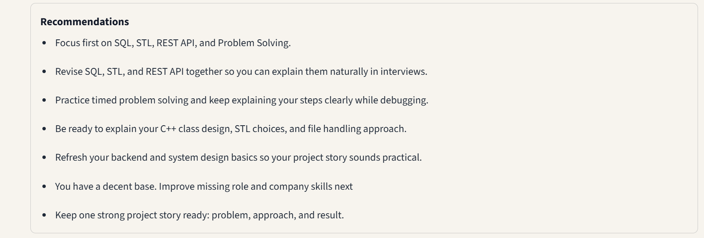

# Resume Skill Gap Analyzer

A C++ based resume analysis system with a Streamlit dashboard.

## Features

- Resume vs Role comparison
- Resume vs Company expectation analysis
- Skill gap detection
- Personalized recommendations
- PDF support
- Live job signal integration
- Public-source web intelligence

## Tech Stack

Backend:
- C++
- OOP
- File Handling
- STL

Frontend:
- Streamlit

Integration:
- Python
- REST APIs

## Screenshots






## Running Locally

```bash
git clone https://github.com/yourusername/resume-skill-gap-analyzer.git
cd resume-skill-gap-analyzer

pip install -r requirements.txt

streamlit run src/ui/app.py
```

Open:

```text
http://localhost:8501
```

### Optional

For live job market data, add your Adzuna API credentials in:

```text
src/ui/.streamlit/secrets.toml
```

## Future Improvements

- AI resume rewriting
- ATS score prediction
- LLM powered recommendations
